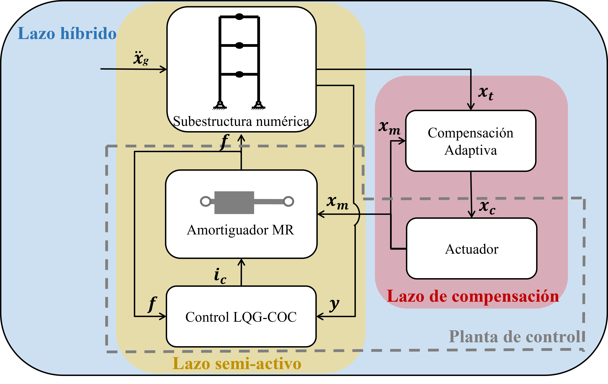

# Simulación hibrida en tiempo real de sistemas estructurales equipados con amortiguador magneto-reológico

## Descripcion

Este repositorio contiene los codigos que son utilizados en la tesis.

## Requerimientos

Matlab 2021a o superior

## Descripcion de las carpetas

Cada carpeta contiene los codigos que son utilizados para el capitulo que se indica en su nombre.

 
